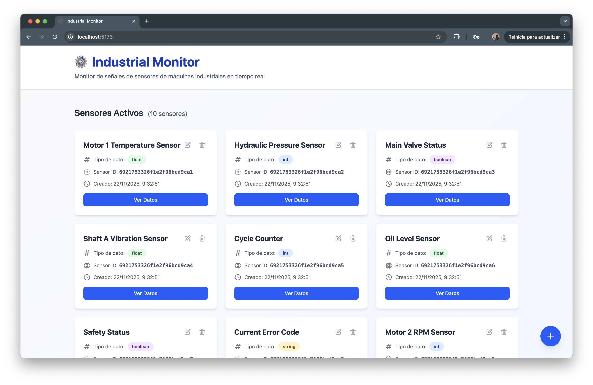
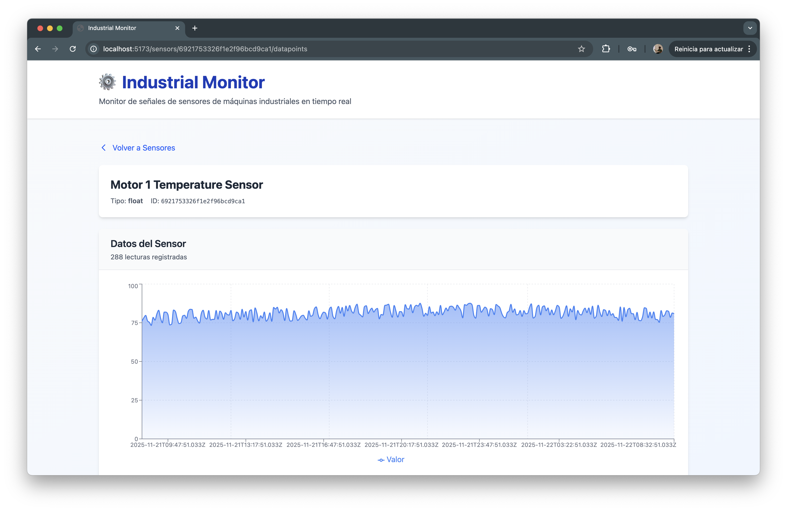
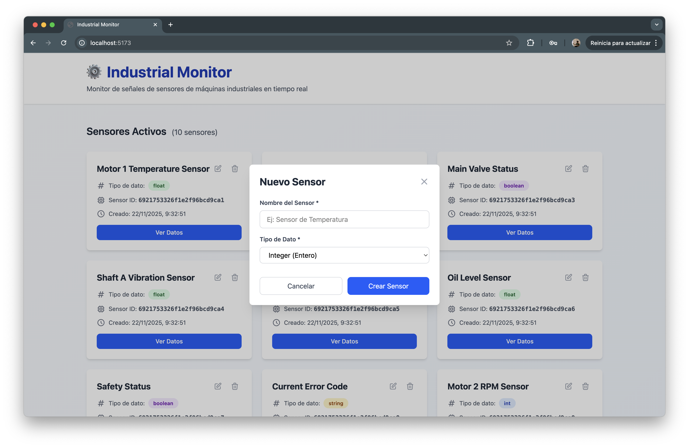
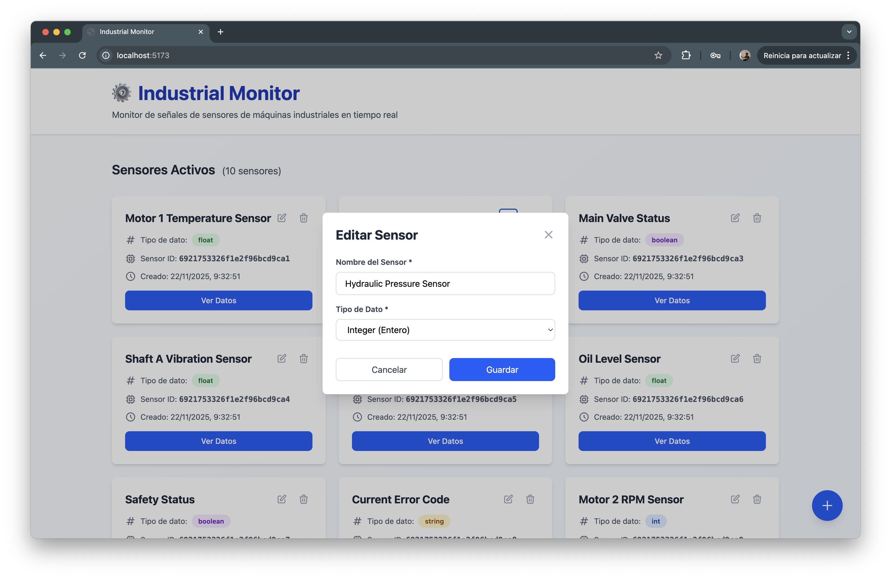

# Presentación del Proyecto DAW

## Información del Repositorio

**Repositorio GitHub:** [https://github.com/juandiegombr/daw.pi.iiava](https://github.com/juandiegombr/daw.pi.iiava)

**URL aplicación:** [https://daw-pi-iiava.vercel.app](https://daw-pi-iiava.vercel.app)

**URL API Backend:** [https://projecte-iiava-backend-eue7f0eghzakbkcd.spaincentral-01.azurewebsites.net](https://projecte-iiava-backend-eue7f0eghzakbkcd.spaincentral-01.azurewebsites.net)

---

## Resumen del Proyecto

**Aplicación Web Full-Stack** desarrollada como parte del curso DAW (Desarrollo de Aplicaciones Web).

### ¿Qué es este proyecto?

Una aplicación web completa que demuestra prácticas profesionales de desarrollo, incluyendo:

- Arquitectura frontend-backend separada
- API RESTful con Express.js
- Base de datos relacional MySQL
- Containerización con Docker para desarrollo
- Despliegue en la nube (Azure + Vercel)
- Pipeline CI/CD automatizado con GitHub Actions

---

## Capturas de Pantalla

### Listado de Sensores



### Detalle de Sensor



### Crear Sensor



### Editar Sensor



---

## Stack Tecnológico

### Backend

- **Node.js** + **Express.js** - API REST
- **MySQL 8.0** + **Sequelize** - Base de datos relacional y ORM
- **CORS** - Gestión de peticiones cross-origin
- **SSL/TLS** - Conexiones seguras a base de datos

### Frontend

- **React** - Biblioteca de interfaz de usuario
- **Next.js** - Framework React para producción con SSR
- **Server-Side Rendering (SSR)** - Renderizado del lado del servidor
- **API Routes** - Reescritura de rutas para proxy de API

### DevOps

- **Docker** + **Docker Compose** - Containerización para desarrollo local
- **GitHub Actions** - CI/CD automatizado
- **Azure** - Infraestructura en la nube
  - **App Service** - Backend Node.js con escalado automático
  - **Azure Database for MySQL** - Base de datos administrada
  - **Application Insights** - Monitorización y logs
- **Vercel** - Hosting frontend con CDN global

---

## Arquitectura en Producción

La aplicación está desplegada en la nube utilizando una arquitectura moderna que combina servicios de Azure y Vercel:

```
┌─────────────────────────────────────────────────────────────┐
│                        Vercel CDN                           │
│                    (Frontend - Next.js)                     │
│                 Global Edge Network (180+ PoPs)             │
└──────────────────────────┬──────────────────────────────────┘
                           │
                           ↓ (API calls to)
┌──────────────────────────────────────────────────────────────┐
│           Azure App Service (Web App)                        │
│          (Backend - Node.js Express API)                     │
│   pi-backend-ahdch5g9ghajbjh3.spaincentral-01.azure...      │
│          - Auto-scaling habilitado                           │
│          - Health checks automáticos                         │
│          - Logs en tiempo real                               │
└──────────────────────────┬──────────────────────────────────┘
                           │
                           ↓ (Database connection)
┌──────────────────────────────────────────────────────────────┐
│        Azure Database for MySQL (Flexible Server)           │
│          projecte-db.mysql.database.azure.com                │
│          - Backups automáticos (7 días retención)            │
│          - SSL/TLS obligatorio                               │
│          - Firewall configurado                              │
└──────────────────────────────────────────────────────────────┘
```

### Componentes en Producción

| Componente | Plataforma | URL | Estado |
|-----------|-----------|-----|--------|
| **Frontend** | Vercel | [daw-pi-iiava.vercel.app](https://daw-pi-iiava.vercel.app) | ✅ Activo |
| **Backend** | Azure App Service | [pi-backend...azurewebsites.net](https://projecte-iiava-backend-eue7f0eghzakbkcd.spaincentral-01.azurewebsites.net) | ✅ Activo |
| **Base de Datos** | Azure MySQL | `projecte-db.mysql.database.azure.com` | ✅ Activo |

### Características de la Arquitectura

- ✅ **Alta Disponibilidad**: Servicios administrados con SLA del 99.9%
- ✅ **Escalabilidad**: Auto-scaling en App Service y Vercel
- ✅ **Seguridad**: HTTPS obligatorio, SSL para base de datos, firewall configurado
- ✅ **Monitorización**: Logs en tiempo real y métricas de rendimiento
- ✅ **CI/CD**: Despliegue automático desde GitHub
- ✅ **CDN Global**: Vercel Edge Network con 180+ puntos de presencia
- ✅ **Backups**: Copias de seguridad automáticas de base de datos
