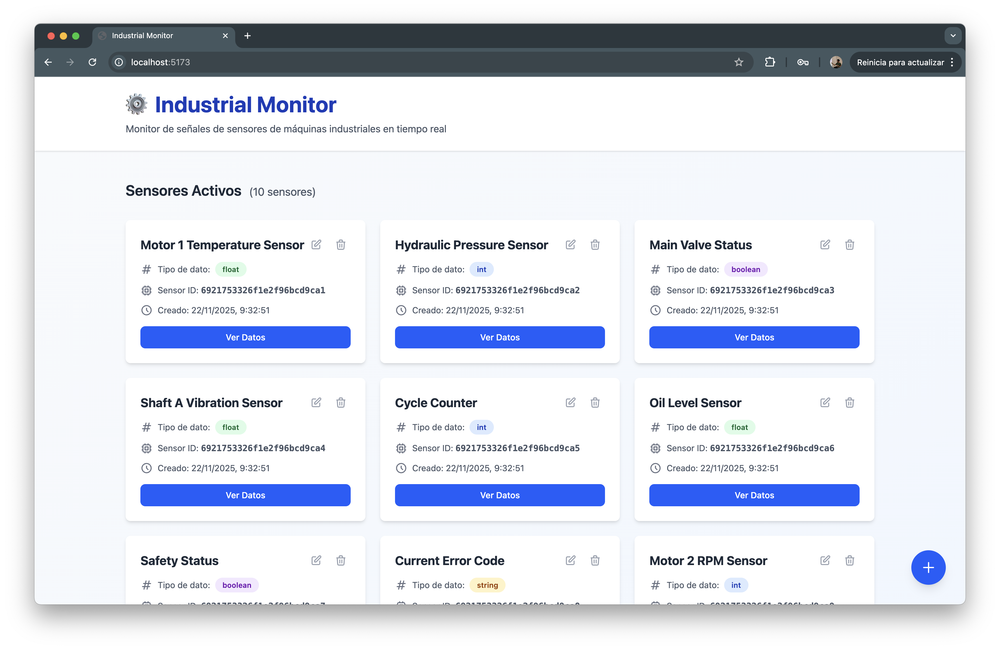
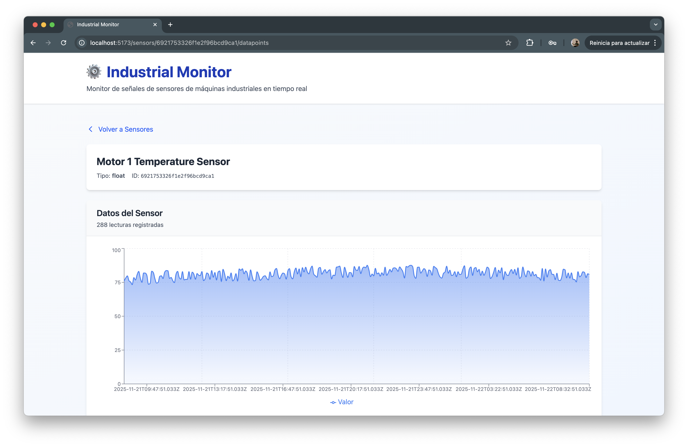
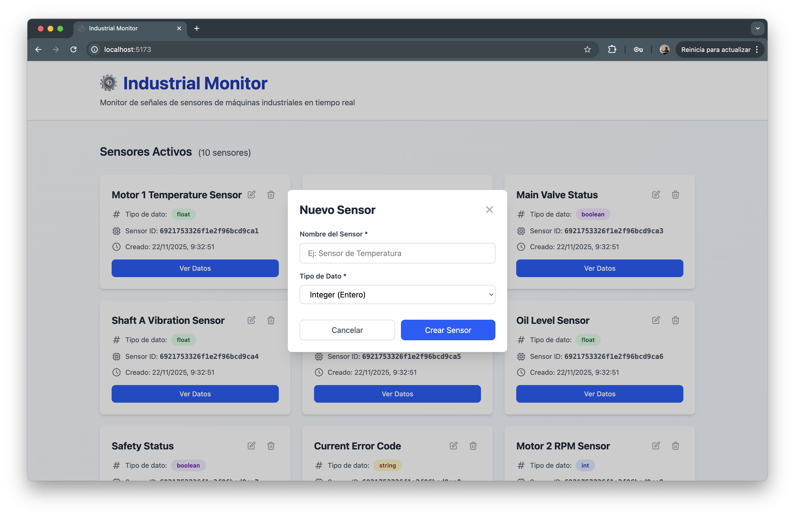
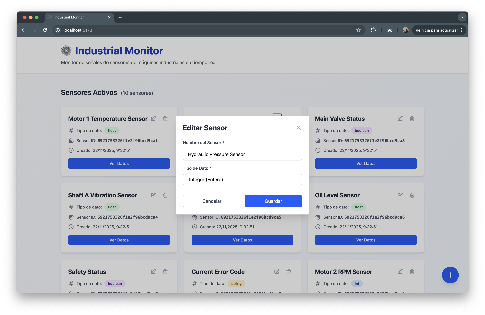

# Presentación del Proyecto DAW

## Información del Repositorio

**Repositorio GitHub:** [https://github.com/juandiegombr/daw.pi.iiava](https://github.com/juandiegombr/daw.pi.iiava)

**URL aplicación:** [https://d12lcsgk45eqvv.cloudfront.net](https://d12lcsgk45eqvv.cloudfront.net)

**URL API Backend:** [https://d12lcsgk45eqvv.cloudfront.net/api](https://d12lcsgk45eqvv.cloudfront.net/api) (servida por CloudFront → EC2)

---

## Resumen del Proyecto

**Aplicación Web Full-Stack** desarrollada como parte del curso DAW (Desarrollo de Aplicaciones Web).

### ¿Qué es este proyecto?

Una aplicación web completa que demuestra prácticas profesionales de desarrollo, incluyendo:

- Arquitectura frontend-backend separada
- API RESTful con Express.js
- Base de datos relacional MySQL
- Containerización con Docker para desarrollo
- Despliegue en la nube (AWS: CloudFront + S3 + EC2 + RDS)
- Pipeline CI/CD automatizado con GitHub Actions

---

## Capturas de Pantalla

### Listado de Sensores



### Detalle de Sensor



### Crear Sensor



### Editar Sensor



---

## Stack Tecnológico

### Backend

- **Node.js** + **Express.js** - API REST
- **MySQL 8.0** + **Sequelize** - Base de datos relacional y ORM
- **CORS** - Gestión de peticiones cross-origin
- **SSL/TLS** - Conexiones seguras a base de datos

### Frontend

- **React** - Biblioteca de interfaz de usuario
- **Next.js** - Framework React para producción con SSR
- **Server-Side Rendering (SSR)** - Renderizado del lado del servidor
- **API Routes** - Reescritura de rutas para proxy de API

### DevOps

- **Docker** + **Docker Compose** - Containerización para desarrollo y producción
- **GitHub Actions** - CI/CD automatizado
- **AWS** - Infraestructura en la nube (región `eu-west-1`)
  - **CloudFront** - CDN global y único punto de entrada público (HTTPS terminado en el edge)
  - **S3** - Alojamiento del frontend estático (`daw-pi-iava-frontend`)
  - **EC2** - Backend Node.js corriendo en un contenedor Docker
  - **RDS MySQL** - Base de datos administrada con backups automáticos

---

## Arquitectura en Producción

La aplicación está desplegada íntegramente en AWS. CloudFront es el único punto de entrada público: sirve el frontend desde S3 y enruta `/api/*` al backend en EC2:

```
                       ┌─────────────────────────┐
                       │     CloudFront (CDN)    │
                       │  d12lcsgk45eqvv.cloudfront.net
                       │  Distribución: E8CAZK17RKQ5Z
                       └────────────┬────────────┘
                                    │
                ┌───────────────────┴───────────────────┐
                │                                       │
        (comportamiento por defecto)             (comportamiento /api/*)
                │                                       │
                ↓                                       ↓
   ┌──────────────────────────┐         ┌─────────────────────────────┐
   │  S3 (estático)           │         │   EC2 + Docker              │
   │  daw-pi-iava-frontend    │         │   ec2-108-129-184-221       │
   │  (build del frontend)    │         │   .eu-west-1.compute...     │
   │                          │         │   Node.js / Express :80→3000│
   └──────────────────────────┘         └──────────────┬──────────────┘
                                                       │
                                                       ↓
                                        ┌─────────────────────────────┐
                                        │     RDS MySQL 8.0           │
                                        │  daw.cjgqeq2gs0wl           │
                                        │  .eu-west-1.rds.amazonaws.com
                                        │  - Backups automáticos      │
                                        │  - Security group privado   │
                                        └─────────────────────────────┘
```

### Componentes en Producción

| Componente | Plataforma | URL / Identificador | Estado |
|-----------|-----------|---------------------|--------|
| **Frontend / CDN** | CloudFront + S3 | [d12lcsgk45eqvv.cloudfront.net](https://d12lcsgk45eqvv.cloudfront.net) | ✅ Activo |
| **Backend** | EC2 + Docker | `ec2-108-129-184-221.eu-west-1.compute.amazonaws.com` | ✅ Activo |
| **Base de Datos** | RDS MySQL 8.0 | `daw.cjgqeq2gs0wl.eu-west-1.rds.amazonaws.com` | ✅ Activo |

### Características de la Arquitectura

- ✅ **Mismo origen**: Frontend y `/api/*` servidos desde el mismo dominio CloudFront → sin CORS
- ✅ **CDN Global**: Edge cache de CloudFront para los assets estáticos
- ✅ **Seguridad**: HTTPS obligatorio (terminado en CloudFront), security groups privados, contenedor con `restart: unless-stopped`
- ✅ **Monitorización**: Logs del contenedor (`docker logs`), métricas de RDS y CloudFront en CloudWatch
- ✅ **CI/CD**: Despliegue automático desde GitHub (S3 sync + CloudFront invalidation; SSH a EC2 + rebuild Docker)
- ✅ **Backups**: RDS hace backups automáticos diarios (7 días de retención por defecto)
